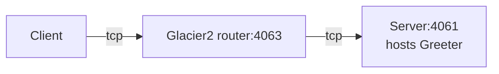

# Glacier2 Greeter

This demo shows how to write a client that calls an Ice object hosted in a server "behind" a Glacier 2 router:



In a typical Glacier2 deployment, the client can establish a connection to the Glacier2 router but cannot establish
a connection to the server, because the server is on a separate network.

## Ice prerequisites

- Install the C++ dev kit.
  - Linux and macOS: see [Ice for C++ installation].
  - Windows: the cmake build downloads and installs the C++ dev kit automatically.
- Install Glacier2. See [Ice service installation].

## Building the demo

To build the demo, run:

```shell
cmake -B build -S . -G Ninja
cmake --build build
```

## Running the demo

1. Start the server in its own terminal:

   **Linux/macOS:**

   ```shell
   ./build/server
   ```

   **Windows:**

   ```shell
   build\server
   ```

2. Start the Glacier2 router in its own terminal:

   ```shell
   glacier2router --Ice.Config=config.glacier2
   ```

   > [!TIP]
   > You can also start the Glacier2 router before the server. The order does not matter: the server is identical to the
   > server provided in the [Ice Greeter][1] demo and does not depend on Glacier2.

3. Start the client in its own terminal:

    **Linux/macOS:**

    ```shell
    ./build/client
    ```

    **Windows:**

    ```shell
    build\client
    ```

[1]: ../../Ice/Greeter
[Ice for C++ installation]: https://github.com/zeroc-ice/ice/blob/main/NIGHTLY.md#ice-for-c
[Ice service installation]: https://github.com/zeroc-ice/ice/blob/main/NIGHTLY.md#ice-services
