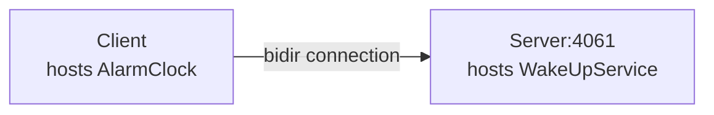

# Bidir

The Bidir demo illustrates how to send requests "the other way around", from a server to a client, by reusing the
connection established by the client to the server.

This demo is very similar to the [Callback][1] demo: with the Callback demo, the server opens a connection to the
client, while with this demo, there is only one connection, from the client to the server:



This is particularly useful when the client application is behind a firewall that does not allow incoming connections.

## Ice prerequisites

- Install the C++ dev kit.
  - Linux and macOS: see [Ice for C++ installation].
  - Windows: the cmake build downloads and installs the C++ dev kit automatically.

## Building the demo

To build the demo, run:

```shell
cmake -B build -S . -G Ninja
cmake --build build
```

## Running the demo

To run the demo, first start the server:

**Linux/macOS:**

```shell
./build/server
```

**Windows:**

```shell
build\server
```

In a separate window, start the client:

**Linux/macOS:**

```shell
./build/client
```

**Windows:**

```shell
build\client
```

[Ice for C++ installation]: https://github.com/zeroc-ice/ice/blob/main/NIGHTLY.md#ice-for-c

[1]: ../callback/
