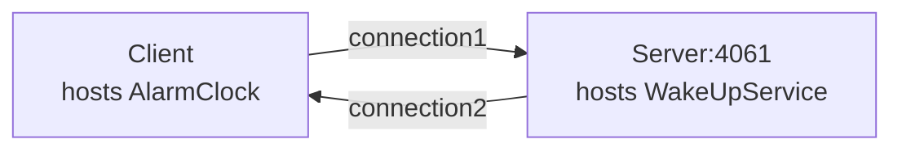

# Callback

The Callback demo illustrates how to implement callbacks in a client application.

In this demo, the client hosts an alarm clock (an Ice object), and asks the server's wake up service to call this
object at a later time. The server opens a TCP connection to the client when making this call.



To build the demo, run:

```shell
cmake -B build -S . -G Ninja
cmake --build build
```

To run the demo, first start the server:

**Linux/macOS:**

```shell
./build/server
```

**Windows:**

```shell
build\server
```

In a separate window, start the client:

**Linux/macOS:**

```shell
./build/client
```

**Windows:**

```shell
build\client
```
