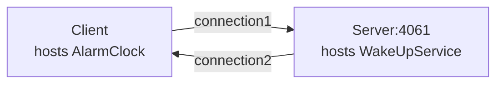

# Callback

The Callback demo illustrates how to implement callbacks in a client application.

In this demo, the client hosts an alarm clock (an Ice object), and asks the server's wake up service to call this
object at a later time. The server opens a TCP connection to the client when making this call.



## Ice prerequisites

- Install the C++ dev kit.
  - Linux and macOS: see [Ice for C++ installation].
  - Windows: the cmake build downloads and installs the C++ dev kit automatically.

## Building the demo

To build the demo, run:

```shell
cmake -B build
cmake --build build --config Release
```

## Running the demo

To run the demo, first start the server:

**Linux/macOS:**

```shell
./build/server
```

**Windows:**

```shell
build\Release\server
```

In a separate window, start the client:

**Linux/macOS:**

```shell
./build/client
```

**Windows:**

```shell
build\Release\client
```

[Ice for C++ installation]: https://github.com/zeroc-ice/ice/blob/main/NIGHTLY.md#ice-for-c
