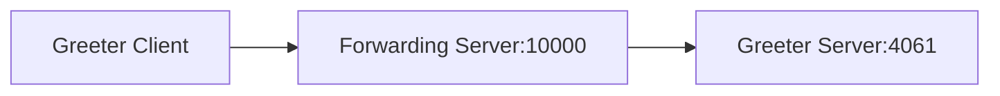

# Forwarder

The Forwarder demo shows how to write a servant that forwards all requests it receives to another remote Ice object,
as-is.

The core of this demo is the generic Forwarding server. This server listens on tcp port 10000 and forwards all
requests to tcp port 4061 on the same host.

The demo also includes a Greeter client and server; these are the usual Greeter client and server, except the client
is configured to use port 10000:



The Forwarding server is generic and can be inserted between any client and server. In particular, the Forwarding server
does not use any Slice generated code.

## Ice prerequisites

- Install the C++ dev kit.
  - Linux and macOS: see [Ice for C++ installation].
  - Windows: the cmake build downloads and installs the C++ dev kit automatically.

## Building the demo

To build the demo, run:

```shell
cmake -B build -S . -G Ninja
cmake --build build
```

The build produces 3 executables: client, server, and forwardingserver.

## Running the demo

To run the demo, first start the server and the forwarding server in separate terminals:

**Linux/macOS:**

```shell
./build/server --Ice.Trace.Dispatch
```

```shell
./build/forwardingserver --Ice.Trace.Dispatch
```

**Windows:**

```shell
build\server --Ice.Trace.Dispatch
```

```shell
build\forwardingserver --Ice.Trace.Dispatch
```

In a third terminal, start the client:

**Linux/macOS:**

```shell
./build/client --Ice.Trace.Network
```

**Windows:**

```shell
build\client --Ice.Trace.Network
```

> [!NOTE]
> The `--Ice.Trace` command-line options are optional: they turn-on tracing (logging) for request dispatches
> (`--Ice.Trace.Dispatch`) and connection establishment/closure (`--Ice.Trace.Network`) and help you follow the call
> flow.

[Ice for C++ installation]: https://github.com/zeroc-ice/ice/blob/main/NIGHTLY.md#ice-for-c
