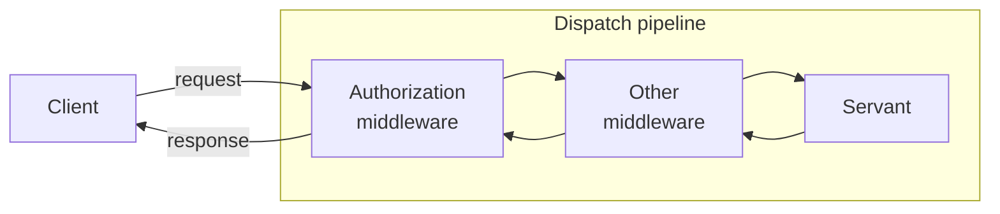

# Middleware

The Middleware demo shows how to write a simple middleware and how to add this middleware to an object adapter.

Each object adapter maintains a dispatch pipeline:



> [!NOTE]
> Other middleware is just an example, and is not provided by this demo.

To build the demo run:

```shell
cmake -B build -S . -G Ninja
cmake --build build
```

To run the demo, first start the server:

**Linux/macOS:**

```shell
./build/server
```

**Windows:**

```shell
build\server
```

In a separate window, start the client:

**Linux/macOS:**

```shell
./build/client
```

**Windows:**

```shell
build\client
```
