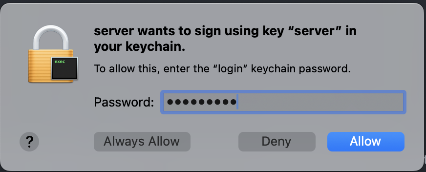

# Ice Secure

This demo shows how to programmatically configure the ssl transport in Ice C++ client and server applications.

It demonstrates how the ssl transport can be configured using the platform's native SSL API:

- **OpenSSL** on Linux
- **Schannel** on Windows
- **Secure Transport** on macOS

Because each platform provides a different SSL API, we implement the configuration logic for each one in a separate C++
source file to keep the code organized and modular:

| File                        | Description                                             |
|-----------------------------|---------------------------------------------------------|
| `ClientRun.cpp`             | Shared client-side logic used by all platform variants. |
| `ClientOpenSSL.cpp`         | OpenSSL client configuration for Linux.                 |
| `ClientSchannel.cpp`        | Schannel client configuration for Windows.              |
| `ClientSecureTransport.cpp` | Secure Transport client configuration for macOS.        |
| `ServerRun.cpp`             | Shared server-side logic used by all platform variants. |
| `ServerOpenSSL.cpp`         | OpenSSL server configuration for Linux.                 |
| `ServerSchannel.cpp`        | Schannel server configuration for Windows.              |
| `ServerSecureTransport.cpp` | Secure Transport server configuration for macOS.        |
| `UtilSchannel.cpp`          | Schannel helper functions.                              |
| `UtilSecureTransport.cpp`   | Secure Transport helper functions.                      |

The types `ClientAuthenticationOptions` and `ServerAuthenticationOptions` used in this demo are aliases that expand to
platform-specific classes:

- On **Linux**, they resolve to [`OpenSSLClientAuthenticationOptions`] and [`OpenSSLServerAuthenticationOptions`].
- On **Windows**, they resolve to [`SchannelClientAuthenticationOptions`] and [`SchannelServerAuthenticationOptions`].
- On **macOS**, they resolve to [`SecureTransportClientAuthenticationOptions`] and
  [`SecureTransportServerAuthenticationOptions`].

This allows you to use a consistent interface across platforms while still taking advantage of native SSL capabilities.

To build the demo, run:

```shell
cmake -B build
cmake --build build --config Release
```

The instructions for running the client and server applications vary slightly depending on the platform.
Refer to the appropriate section below for your target platform:

---

## Linux

First, start the server:

```shell
./build/server --Ice.Trace.Network --IceSSL.Trace.Security
```

In a separate window, start the client:

```shell
./build/client --Ice.Trace.Network --IceSSL.Trace.Security
```

> The `--Ice.Trace.Network` and `--IceSSL.Trace.Security` command-line arguments are optional.
> They enable network and security tracing, respectively.
> Network tracing shows that the client and server communicate using the ssl transport,
> while security tracing provides details about the SSL protocol and cipher used for the connection.

---

## macOS

On macOS, the server certificate and private key must be imported into a keychain before the server application can
use them.

This demo uses the `security import` command to import the server’s PKCS#12 file (`.p12`) into the default keychain
(typically the login keychain):

```shell
security import ../../../certs/server.p12 -P password
```

> It is possible to import the certificate and private key programmatically using the [Keychain Services] API,
> but this is beyond the scope of this demo.

You can now start the server:

```shell
./build/server
```

In a separate window, start the client:

```shell
./build/client
```

When the client connects to the server, macOS will prompt you to allow the server to access the private key.
Enter your keychain password and click **Always Allow** to grant the server permanent access.



Subsequent uses of the server certificate will not require any further manual intervention.

> The `--Ice.Trace.Network` and `--IceSSL.Trace.Security` command-line arguments are optional.
> They enable network and security tracing, respectively.
> Network tracing shows that the client and server communicate using the ssl transport,
> while security tracing provides details about the SSL protocol and cipher used for the connection.

---

## Windows

First, start the server:

```shell
build\Release\server --Ice.Trace.Network --IceSSL.Trace.Security
```

In a separate window, start the client:

```shell
build\Release\client --Ice.Trace.Network --IceSSL.Trace.Security
```

> The `--Ice.Trace.Network` and `--IceSSL.Trace.Security` command-line arguments are optional.
> They enable network and security tracing, respectively.
> Network tracing shows that the client and server communicate using the ssl transport,
> while security tracing provides details about the SSL protocol and cipher used for the connection.

---

[Keychain Services]: https://developer.apple.com/documentation/security/keychain-services?language=objc
[`OpenSSLClientAuthenticationOptions`]: https://code.zeroc.com/ice/main/api/cpp/structIce_1_1SSL_1_1OpenSSLClientAuthenticationOptions.html
[`OpenSSLServerAuthenticationOptions`]: https://code.zeroc.com/ice/main/api/cpp/structIce_1_1SSL_1_1OpenSSLServerAuthenticationOptions.html
[`SchannelClientAuthenticationOptions`]: https://code.zeroc.com/ice/main/api/cpp/structIce_1_1SSL_1_1SchannelClientAuthenticationOptions.html
[`SchannelServerAuthenticationOptions`]: https://code.zeroc.com/ice/main/api/cpp/structIce_1_1SSL_1_1SchannelServerAuthenticationOptions.html
[`SecureTransportClientAuthenticationOptions`]: https://code.zeroc.com/ice/main/api/cpp/structIce_1_1SSL_1_1SecureTransportClientAuthenticationOptions.html
[`SecureTransportServerAuthenticationOptions`]: https://code.zeroc.com/ice/main/api/cpp/structIce_1_1SSL_1_1SecureTransportServerAuthenticationOptions.html
