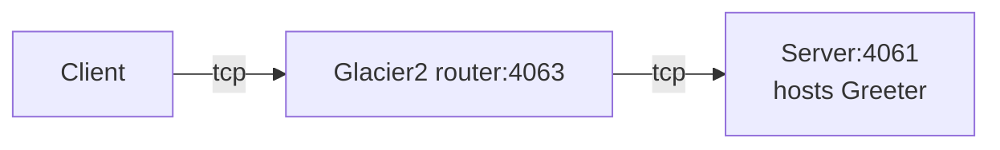

# IceGrid Greeter

This demo shows how to write a client that calls an Ice object hosted in a server "behind" a Glacier 2 router:



In a typical Glacier2 deployment, the client can establish a connection to the Glacier2 router but cannot establish
a connection to the server, because the server is on a separate network.

Follow these steps to build and run the demo:

1. Build the client and server applications:

   ```shell
   cmake -B build
   cmake --build build --config Release
   ```

2. Start the IceGrid registry in its own terminal:

   ```shell
   icegridregistry --Ice.Config=config.registry
   ```

3. Start the IceGrid node in its own terminal:

   ```shell
   icegridnode --Ice.Config=config.node
   ```

4. Deploy the "GreeterHall" application in this IceGrid deployment:

   ```shell
   icegridadmin --Ice.Config=config.admin -e "application add greeter-hall.xml"
   ```

   `greeter-hall.xml` configures a single Greeter server. As an alternative, you can deploy 3 replicated Greeter servers
   with:

   ```shell
   icegridadmin --Ice.Config=config.admin -e "application add greeter-hall-with-replication.xml"
   ```

   > [!TIP]
   > Use `update` instead of `add` to update an existing application.

5. Start the client in its own terminal:

    **Linux/macOS:**

    ```shell
    ./build/client
    ```

    **Windows:**

    ```shell
    build\Release\client
    ```
