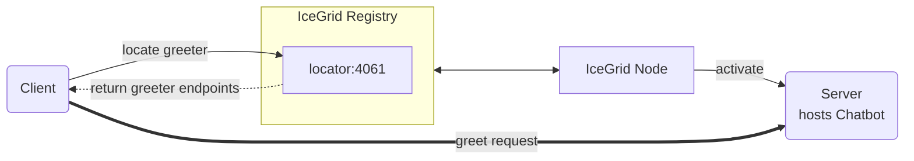

# IceGrid Greeter

The IceGrid Greeter demo illustrates how to create a very simple IceGrid deployment that manages a Greeter server.



## Ice prerequisites

- Install the C++ dev kit.
  - Linux and macOS: see [Ice for C++ installation].
  - Windows: the cmake build downloads and installs the C++ dev kit automatically.
- Install IceGrid. See [Ice service installation].

## Building the demo

To build the demo, run:

```shell
cmake -B build -S . -G Ninja
cmake --build build
```

## Running the demo

1. Start the IceGrid registry in its own terminal:

   ```shell
   icegridregistry --Ice.Config=config.registry
   ```

2. Start the IceGrid node in its own terminal:

   ```shell
   icegridnode --Ice.Config=config.node
   ```

3. Deploy the "GreeterHall" application in this IceGrid deployment:

   ```shell
   icegridadmin --Ice.Config=config.admin -e "application add greeter-hall.xml"
   ```

   `greeter-hall.xml` configures a single Greeter server. As an alternative, you can deploy 3 replicated Greeter servers
   with:

   ```shell
   icegridadmin --Ice.Config=config.admin -e "application add greeter-hall-with-replication.xml"
   ```

   > [!TIP]
   > Use `update` instead of `add` to update an existing application.

4. Start the client in its own terminal:

    **Linux/macOS:**

    ```shell
    ./build/client
    ```

    **Windows:**

    ```shell
    build\client
    ```

[Ice for C++ installation]: https://github.com/zeroc-ice/ice/blob/main/NIGHTLY.md#ice-for-c
[Ice service installation]: https://github.com/zeroc-ice/ice/blob/main/NIGHTLY.md#ice-services
