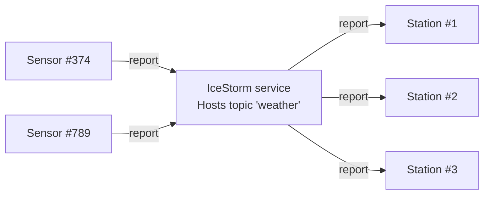

# IceStorm Weather

This demo shows how to use IceStorm to create a simple pub-sub application. In this demo, one or more weather sensors
report the local temperature and humidity to one or more weather stations via IceStorm. The sensors are the publishers
while the weather stations are the subscribers.



Follow these steps to build and run the demo:

1\. Build the sensor and station applications:

```shell
cmake -B build
cmake --build build --config Release
```

2\. Start the IceStorm service in its own terminal:

```shell
icebox --IceBox.Service.IceStorm="IceStormService,38a0:createIceStorm --Ice.Config=config.icestorm"
```

3\. Run one or more sensors and weather stations, each in its own terminal. You can start them in any order.

To start a weather station:

**Linux/macOS:**

```shell
./build/station
```

**Windows:**

```shell
build\Release\station
```

To start a weather sensor:

**Linux/macOS:**

```shell
./build/sensor
```

**Windows:**

```shell
build\Release\sensor
```
