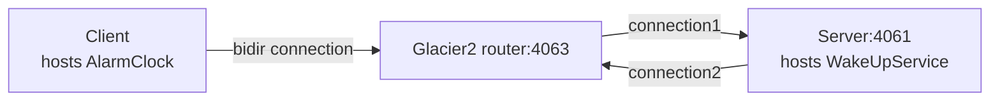

# Glacier2 Callback

This demo shows how to write a client that establishes a session with a Glacier2 router. It also shows how to implement
callbacks in this client.

This demo is similar to the [Ice Callback][1] demo, except all communications go through the Glacier router.

The connection between the client and the Glacier2 router is a "bidir" connection, like in the [Ice Bidir][2] demo:



## Ice prerequisites

- Install Glacier2. See [Glacier2 installation].

## Building the demo

To build the demo, run:

```shell
dotnet build
```

## Running the demo

First, start the Server program in its own terminal:

```shell
cd Server
dotnet run
```

Then, start the Glacier2 router in its own terminal:

```shell
glacier2router --Ice.Config=glacier2.conf
```

> [!TIP]
> You can also start the Glacier2 router before the server. The order does not matter: the server is identical to the
> server provided in the [Ice Callback][1] demo and does not depend on Glacier2.

Finally, run the client application:

```shell
cd Client
dotnet run
```

[Glacier2 installation]: https://zeroc.com/ice/downloads/3.8/glacier2

[1]: ../../Ice/Callback
[2]: ../../Ice/Bidir
