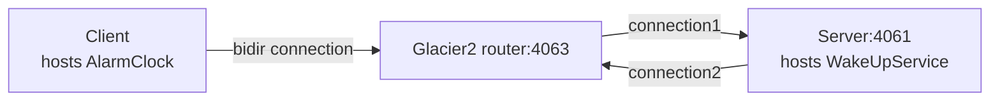

# Glacier2 Callback

This demo shows how to write a client that establishes a session with a Glacier2 router. It also shows how to implement
callbacks in this client.

This demo is similar to the [Ice Callback][1] demo, except all communications go through the Glacier router.

The connection between the client and the Glacier2 router is a "bidir" connection, like in the [Ice Bidir][2] demo:



Follow these steps to build and run the demo:

1. Build the client and server applications:

``` shell
dotnet build
```

2. Start the Server program in its own terminal:

```shell
cd Server
dotnet run
```

3. Start the Glacier2 router in its own terminal:

```
glacier2router --Ice.Config=config.glacier2
```

> [!TIP]
> You can also start the Glacier2 router before the server. The order does not matter: the server is identical to the
> server provided in the [Ice Callback][1] demo and does not depend on Glacier2.

4. Run the client application:

```shell
cd Client
dotnet run
```

[1]: ../../Ice/Callback
[2]: ../../Ice/Bidir
