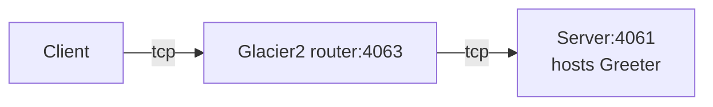

# Glacier2 Greeter

This demo shows how to write a client that calls an Ice object hosted in a server "behind" a Glacier2 router:



In a typical Glacier2 deployment, the client can establish a connection to the Glacier2 router but cannot establish
a connection to the server, because the server is on a separate network.

## Ice prerequisites

- Install the Glacier2 router. See [Ice service installation].

## Building the demo

To build the demo, run:

```shell
dotnet build
```

## Running the demo

First, start the Server program in its own terminal:

```shell
cd Server
dotnet run
```

Then, start the Glacier2 router in its own terminal:

```shell
glacier2router --Ice.Config=config.glacier2
```

> [!TIP]
> You can also start the Glacier2 router before the server. The order does not matter: the server is identical to the
> server provided in the [Ice Greeter][1] demo and does not depend on Glacier2.

Finally, run the client application:

```shell
cd Client
dotnet run
```

[Ice service installation]: https://github.com/zeroc-ice/ice/blob/main/NIGHTLY.md#ice-services

[1]: ../../Ice/Greeter
