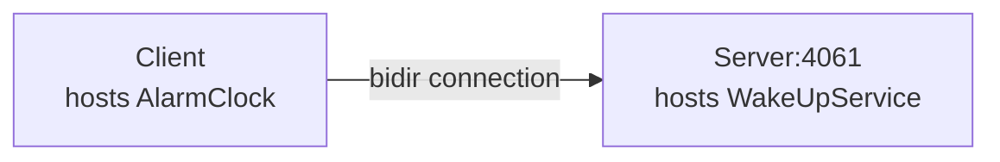

# Ice Bidir

The Bidir demo illustrates how to send requests "the other way around", from a server to a client, by reusing the
connection established by the client to the server.

This demo is very similar to the [Callback][1] demo: with the Callback demo, the server opens a connection to the
client, while with this demo, there is only one connection, from the client to the server:



This is particularly useful when the client application is behind a firewall that does not allow incoming connections.

You can build the client and server applications with:

``` shell
dotnet build
```

First start the Server program:

```shell
cd Server
dotnet run
```

In a separate terminal, start the Client program:

```shell
cd Client
dotnet run
```

[1]: ../Callback
