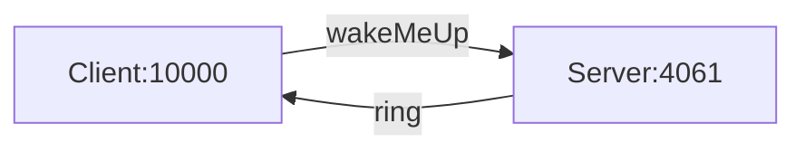

# Callback

The Callback demo illustrates how to implement callbacks in a client application.

In this demo, the client hosts an alarm clock (an Ice object), and asks the server to call this object at a later time.



You can build the client and server applications with:

``` shell
dotnet build
```

First start the Server program:

```shell
cd Server
dotnet run
```

In a separate terminal, start the Client program:

```shell
cd Client
dotnet run
```
