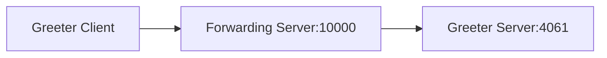

# Ice Forwarder

The Forwarder demo shows how to write a servant that forwards all requests it receives to another remote Ice object,
as-is.

The core of this demo is the generic Forwarding server. This server listens on tcp port 10000 and forwards all
requests to tcp port 4061 on the same host.

The demo also includes a Greeter client and server; these are the usual Greeter client and server, except the client
is configured to use port 10000:



The Forwarding server is generic and can be inserted between any client and server. In particular, the Forwarding server
does not use any Slice generated code.

## Building the demo

To build the demo, run:

```shell
dotnet build
```

## Running the demo

First, start the Forwarding server and Greeter server in separate terminals:

```shell
cd Server
dotnet run --Ice.Trace.Dispatch
```

```shell
cd ForwardingServer
dotnet run --Ice.Trace.Dispatch
```

Then, in a third terminal, start the Client program:

```shell
cd Client
dotnet run --Ice.Trace.Network
```

> [!NOTE]
> The `--Ice.Trace` command-line options are optional: they turn-on tracing (logging) for request dispatches
> (`--Ice.Trace.Dispatch`) and connection establishment/closure (`--Ice.Trace.Network`) and help you follow the call
> flow.
