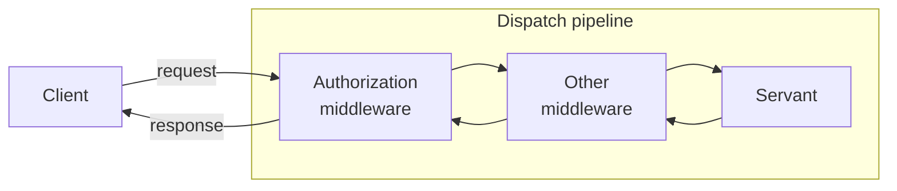

# Ice Middleware

The Middleware demo shows how to write a simple middleware and how to add this middleware to an object adapter.

Each object adapter maintains a dispatch pipeline:



> [!NOTE]
> Other middleware is just an example, and is not provided by this demo.

## Building the demo

To build the demo, run:

```shell
dotnet build
```

## Running the demo

First, start the Server program:

```shell
cd Server
dotnet run
```

Then, in a separate terminal, start the Client program:

```shell
cd Client
dotnet run
```
