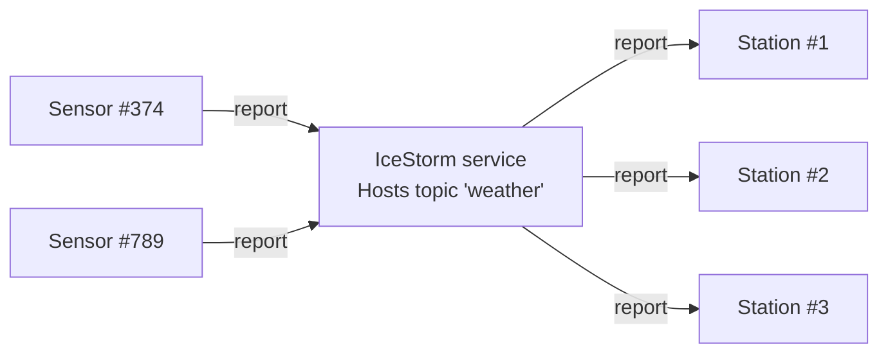

# IceStorm Weather

This demo shows how to use IceStorm to create a simple pub-sub application. In this demo, one or more weather sensors
report the local temperature and humidity to one or more weather stations via IceStorm. The sensors are the publishers
while the weather stations are the subscribers.



You can build the weather sensor and weather station applications with:

```shell
dotnet build
```

Next, run the IceStorm service in its own terminal:

```shell
icebox --IceBox.Service.IceStorm="IceStormService,38a0:createIceStorm --Ice.Config=config.icestorm"
```

Then, run one or more sensors and weather stations, each in its own terminal. You can start them in any order.

```shell
cd Sensor
dotnet run
```

```shell
cd Station
dotnet run
```
