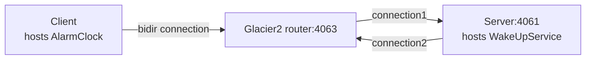

# Glacier2 Callback

This demo shows how to write a client that establishes a session with a Glacier2 router. It also shows how to implement
callbacks in this client.

This demo is similar to the [Ice Callback][1] demo, except all communications go through the Glacier router.

The connection between the client and the Glacier2 router is a "bidir" connection, like in the [Ice Bidir][2] demo:



## Ice prerequisites

- Install Glacier2. See [Ice service installation].

## Building the demo

The demo has two Gradle projects, **client** and **server**, both using the [application plugin].

To build the demo, run:

```shell
./gradlew build
```

## Running the demo

Start the Server program in its own terminal:

```shell
./gradlew :server:run --quiet
```

Next, start the Glacier2 router in its own terminal:

```shell
glacier2router --Ice.Config=config.glacier2
```

> [!TIP]
> You can also start the Glacier2 router before the server. The order does not matter: the server is identical to the
> server provided in the [Ice Greeter][1] demo and does not depend on Glacier2.

Finally, in a separate terminal, start the client application:

```shell
./gradlew :client:run --quiet
```

[Application plugin]: https://docs.gradle.org/current/userguide/application_plugin.html

[1]: ../callback
[2]: ../bidir
