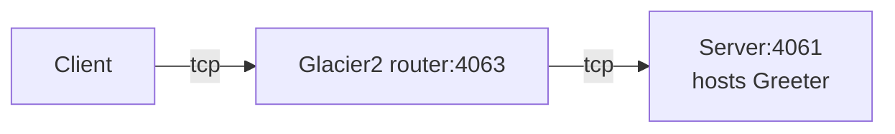

# Glacier2 Greeter

This demo shows how to write a client that calls an Ice object hosted in a server "behind" a Glacier2 router:



In a typical Glacier2 deployment, the client can establish a connection to the Glacier2 router but cannot establish
a connection to the server, because the server is on a separate network.

## Ice prerequisites

- Install Glacier2. See [Ice service installation].

## Building the Project

This project uses Gradle and the [Application plugin]. To build the client and server applications, run:

```shell
./gradlew build
```

## Running the Server

Start the Server program in its own terminal:

```shell
./gradlew :server:run --quiet
```

Next, start the Glacier2 router in its own terminal:

```shell
glacier2router --Ice.Config=config.glacier2
```

> [!TIP]
> You can also start the Glacier2 router before the server. The order does not matter: the server is identical to the
> server provided in the [Ice Greeter][1] demo and does not depend on Glacier2.

## Running the Client

Then, in a separate terminal, start the client application:

```shell
./gradlew :client:run --quiet
```

[Application plugin]: https://docs.gradle.org/current/userguide/application_plugin.html
[Ice service installation]: https://github.com/zeroc-ice/ice/blob/main/NIGHTLY.md#ice-services
