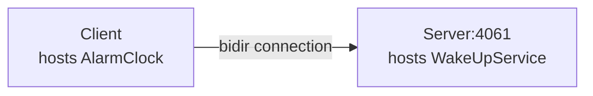

# Ice Bidir

The Bidir demo illustrates how to send requests "the other way around", from a server to a client, by reusing the
connection established by the client to the server.

This demo is very similar to the [Callback][1] demo: with the Callback demo, the server opens a connection to the
client, while with this demo, there is only one connection, from the client to the server:



This is particularly useful when the client application is behind a firewall that does not allow incoming connections.

## Building the Project

This project uses Gradle and the [Application plugin]. To build the client and server applications, run:

```shell
./gradlew build
```

## Running the Server

First, start the server application:

```shell
./gradlew :server:run --quiet
```

## Running the Client

Then, in a separate terminal, start the client application:

```shell
./gradlew :client:run --quiet
```

[Application plugin]: https://docs.gradle.org/current/userguide/application_plugin.html

[1]: ../callback
