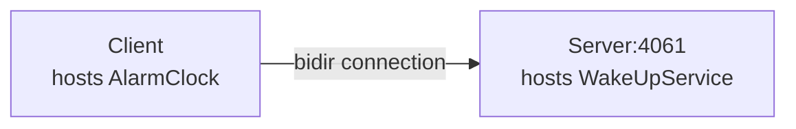

# Ice Bidir

The Bidir demo illustrates how to send requests "the other way around", from a server to a client, by reusing the
connection established by the client to the server.

This demo is very similar to the [Callback][1] demo: with the Callback demo, the server opens a connection to the
client, while with this demo, there is only one connection, from the client to the server:


```mermaid
flowchart LR
    c[Client<br>hosts AlarmClock] --bidir connection--> s[Server:4061<br>hosts WakeUpService]
```

This is particularly useful when the client application is behind a firewall that does not allow incoming connections.

> [!NOTE]
> On Windows, run all the commands below in Git Bash or PowerShell; they don't work in the cmd.exe Command Prompt.

## Building the demo

The demo has two Gradle projects, **client** and **server**, both using the [application plugin].

To build the demo, run:

```shell
./gradlew installDist
```

This creates a self-contained distribution under build/install/ for each application, with launcher scripts in its
bin/ directory.

## Running the demo

First, start the server application:

```shell
./server/build/install/server/bin/server
```

Then, in a separate terminal, start the client application:

```shell
./client/build/install/client/bin/client
```

[Application plugin]: https://docs.gradle.org/current/userguide/application_plugin.html

[1]: ../callback
