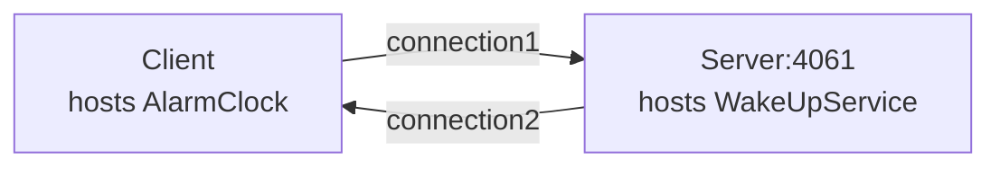

# Ice Callback

The Callback demo illustrates how to implement callbacks in a client application.

In this demo, the client hosts an alarm clock (an Ice object), and asks the server's wake up service to call this
object at a later time. The server opens a TCP connection to the client when making this call.



## Building the Project

This project uses Gradle and the [Application plugin]. To build the client and server applications, run:

```shell
./gradlew build
```

This will compile each project and install the distributions in the `build/install` subdirectory of each project.

## Running the Server

First, start the server application:

```shell
./gradlew :server:run --quiet
```

## Running the Client

Then, in a separate terminal, start the client application:

```shell
./gradlew :client:run --quiet
```

[Application plugin]: https://docs.gradle.org/current/userguide/application_plugin.html
