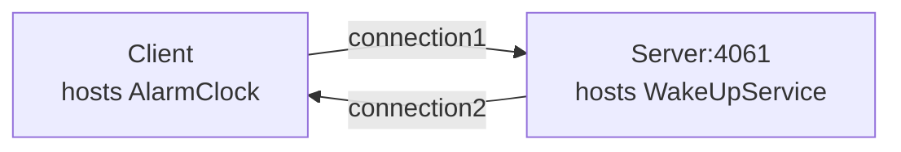

# Ice Callback

The Callback demo illustrates how to implement callbacks in a client application.

In this demo, the client hosts an alarm clock (an Ice object), and asks the server's wake up service to call this
object at a later time. The server opens a TCP connection to the client when making this call.


```mermaid
flowchart LR
    c[Client<br>hosts AlarmClock] --connection1--> s[Server:4061<br>hosts WakeUpService]
    s --connection2--> c
```

> [!NOTE]
> On Windows, run all the commands below in Git Bash or PowerShell; they don't work in the cmd.exe Command Prompt.

## Building the demo

The demo has two Gradle projects, **client** and **server**, both using the [application plugin].

To build the demo, run:

```shell
./gradlew installDist
```

This creates a self-contained distribution under build/install/ for each application, with launcher scripts in its
bin/ directory.

## Running the demo

First, start the server application:

```shell
./server/build/install/server/bin/server
```

Then, in a separate terminal, start the client application:

```shell
./client/build/install/client/bin/client
```

[Application plugin]: https://docs.gradle.org/current/userguide/application_plugin.html
