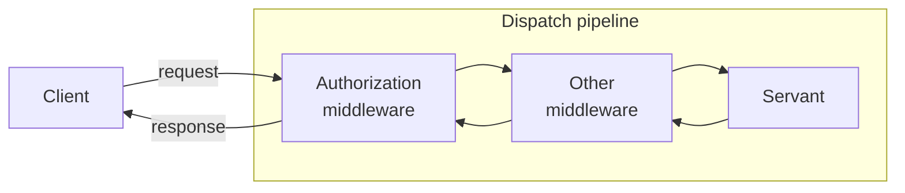

# Ice Middleware

The Middleware demo shows how to write a simple middleware and how to add this middleware to an object adapter.

Each object adapter maintains a dispatch pipeline:



> [!NOTE]
> Other middleware is just an example, and is not provided by this demo.

## Building the Project

This project uses Gradle and the [Application plugin]. To build the client and server applications, run:

```shell
./gradlew build
```

This will compile each project and install the distributions in the `build/install` subdirectory of each project.

## Running the Server

First, start the server application:

```shell
./gradlew :server:run --quiet
```

## Running the Client

Then, in a separate terminal, start the client application:

```shell
./gradlew :client:run --quiet
```

[Application plugin]: https://docs.gradle.org/current/userguide/application_plugin.html
