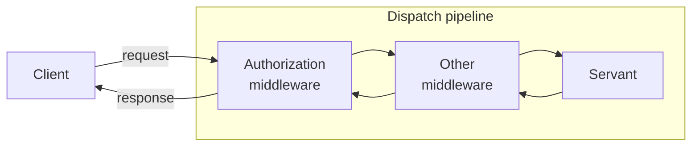

# Ice Middleware

The Middleware demo shows how to write a simple middleware and how to add this middleware to an object adapter.

Each object adapter maintains a dispatch pipeline:


```mermaid
flowchart LR
    client[Client] -- request --> am -- response --> client
    subgraph pipeline [Dispatch pipeline]
        direction LR
        am[Authorization <br>middleware] --> om[Other <br>middleware] --> Servant --> om --> am
    end
```

> [!NOTE]
> Other middleware is just an example, and is not provided by this demo.

## Building the demo

> [!NOTE]
> On Windows, run all the commands below in Git Bash or PowerShell; they don't work in the cmd.exe Command Prompt.

The demo has two Gradle projects, **client** and **server**, both using the [application plugin].

To build the demo, run:

```shell
./gradlew installDist
```

This creates a self-contained distribution under build/install/ for each application, with launcher scripts in its
bin/ directory.

## Running the demo

First, start the server application:

```shell
./server/build/install/server/bin/server
```

Then, in a separate terminal, start the client application:

```shell
./client/build/install/client/bin/client
```

[Application plugin]: https://docs.gradle.org/current/userguide/application_plugin.html
