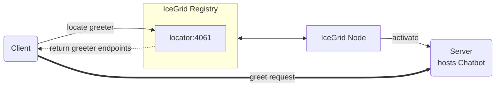

# IceGrid Greeter

The IceGrid Greeter demo illustrates how to create a very simple IceGrid deployment that manages a Greeter server.



## Ice prerequisites

- Install IceGrid. See [IceGrid installation].

## Building the demo

The demo has two Gradle projects, **client** and **server**, both using the [application plugin].

To build the demo, run:

```shell
./gradlew installDist
```

This creates a self-contained distribution under build/install/ for each application.
Each distribution includes:

- a bin/ directory with start scripts, and
- a lib/ directory containing the application JAR and all its runtime dependencies.

In our IceGrid deployment, we call java directly and set the class path to include everything in the distribution’s lib/
directory. This ensures both the server JAR and its dependencies (such as Ice) are available at runtime.

## Running the demo

First, start the IceGrid registry in its own terminal:

```shell
icegridregistry --Ice.Config=registry.conf
```

Then, start the IceGrid node in its own terminal:

```shell
icegridnode --Ice.Config=node.conf
```

Next, deploy the "GreeterHall" application in this IceGrid deployment:

```shell
icegridadmin --Ice.Config=admin.conf -e "application add greeter-hall.xml"
```

`greeter-hall.xml` configures a single Greeter server. As an alternative, you can deploy 3 replicated Greeter servers
with:

```shell
icegridadmin --Ice.Config=admin.conf -e "application add greeter-hall-with-replication.xml"
```

> [!TIP]
> Use `update` instead of `add` to update an existing application.

Finally, run the client application:

```shell
./gradlew :client:run --quiet
```

[Application plugin]: https://docs.gradle.org/current/userguide/application_plugin.html
[IceGrid installation]: https://zeroc.com/ice/downloads/3.8/icegrid
