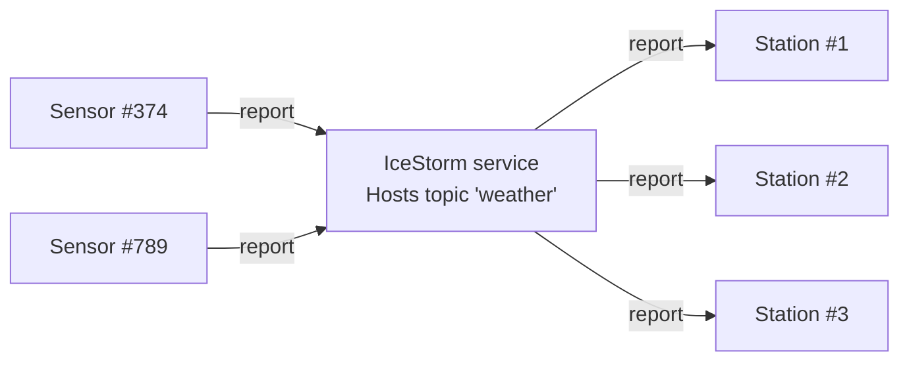

# IceStorm Weather

This demo shows how to use IceStorm to create a simple pub-sub application. In this demo, one or more weather sensors
report the local temperature and humidity to one or more weather stations via IceStorm. The sensors are the publishers
while the weather stations are the subscribers.



## Ice prerequisites

- Install IceStorm. See [IceStorm installation].

## Building the demo

The demo has two Gradle projects, **sensor** and **station**, both using the [application plugin].

To build the demo, run:

```shell
./gradlew build
```

## Running the demo

First, run the IceStorm service in its own terminal:

```shell
icebox --IceBox.Service.IceStorm="IceStormService,38:createIceStorm --Ice.Config=icestorm.conf"
```

Then, run one or more sensors and weather stations, each in its own terminal. You can start them in any order.

```shell
./gradlew :sensor:run
```

```shell
./gradlew :station:run
```

[Application plugin]: https://docs.gradle.org/current/userguide/application_plugin.html
[IceStorm installation]: https://zeroc.com/ice/downloads/3.8/icestorm
