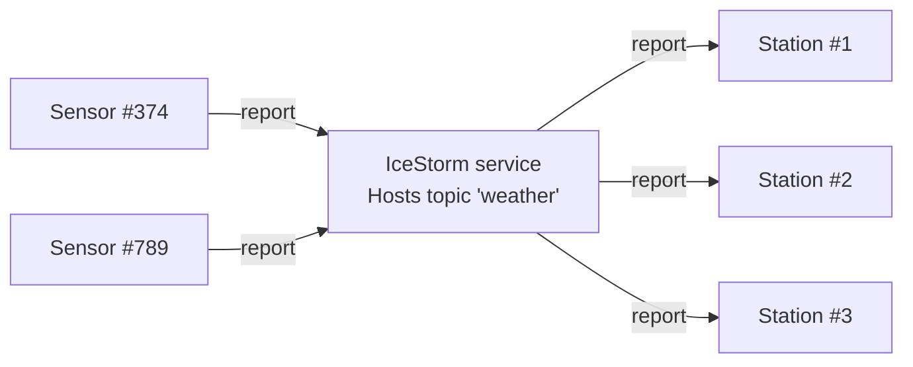

# IceStorm Weather

This demo shows how to use IceStorm to create a simple pub-sub application. In this demo, one or more weather sensors
report the local temperature and humidity to one or more weather stations via IceStorm. The sensors are the publishers
while the weather stations are the subscribers.


```mermaid
flowchart LR
    p1[Sensor #374] --report--> icestorm[IceStorm service<br>Hosts topic 'weather']
    p2[Sensor #789] --report--> icestorm
    icestorm --report--> s1[Station #1]
    icestorm --report--> s2[Station #2]
    icestorm --report--> s3[Station #3]
```

> [!NOTE]
> On Windows, run all the commands below in Git Bash or PowerShell; not all of them work in the cmd.exe Command
> Prompt.

## Ice prerequisites

- Install IceStorm. See [IceStorm installation].

## Building the demo

The demo has two Gradle projects, **sensor** and **station**, both using the [application plugin].

To build the demo, run:

```shell
./gradlew installDist
```

This creates a self-contained distribution under build/install/ for each application, with launcher scripts in its
bin/ directory.

## Running the demo

First, run the IceStorm service in its own terminal, from this demo's directory:

```shell
icebox --IceBox.Service.IceStorm="IceStormService,38:createIceStorm --Ice.Config=icestorm.conf"
```

Then, run one or more sensors and weather stations, each in its own terminal. You can start them in any order.

```shell
./sensor/build/install/sensor/bin/sensor
```

```shell
./station/build/install/station/bin/station
```

[Application plugin]: https://docs.gradle.org/current/userguide/application_plugin.html
[IceStorm installation]: https://zeroc.com/ice/downloads/3.8/icestorm
