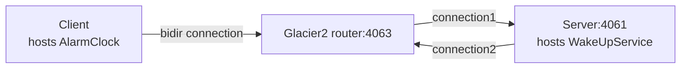

# Glacier2 Callback

This demo shows how to write a client that establishes a session with a Glacier2 router. It also shows how to implement
callbacks in this client.

The connection between the client and the Glacier2 router is a "bidir" connection, like in the [Ice Bidir][1] demo:



## Ice prerequisites

Install Glacier2. See [Ice service installation].

## Building the demo

First install npm dependencies:

```shell
npm install
```

Then, to build the client application, run:

```shell
npm run build
```

## Running the demo

Run the server application:

Ice for JavaScript has limited server-side support. As a result, you need to start a Callback server implemented in a
language that fully supports server-side functionality, such as Python, Java, or C#.

Then, start the Glacier2 router in its own terminal:

```shell
glacier2router --Ice.Config=config.glacier2
```

> [!TIP]
> You can also start the Glacier2 router before the server. The order does not matter.

Finally, run the client application:

```shell
node client.js
```

[1]: ../../Ice/bidir/
[Ice service installation]: https://github.com/zeroc-ice/ice/blob/main/NIGHTLY.md#ice-services
