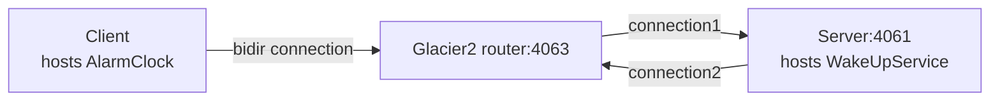

# Glacier2 Callback

This demo shows how to write a client that establishes a session with a Glacier2 router. It also shows how to implement
callbacks in this client.

The connection between the client and the Glacier2 router is a "bidir" connection, like in the [Ice Bidir][2] demo:



Follow these steps to build and run the demo:

1. Install the dependencies:

    ```shell
    npm install
    ```

2. Build the client application:

    ```shell
    npm run build
    ```

3. Run the server application:

    Ice for JavaScript has limited server-side support ([see documentation][1]). As a result, you need to start a
    Glacier2 Callback server implemented in a language that fully supports server-side functionality, such as Python,
    Java, or C#.

4. Start the Glacier2 router in its own terminal:

   ```shell
   glacier2router --Ice.Config=config.glacier2
   ```

   > [!TIP]
   > You can also start the Glacier2 router before the server.

5. Run the client application:

    ```shell
    node client.js
    ```

[1]: https://doc.zeroc.com/ice/3.7/language-mappings/javascript-mapping
[2]: ../../Ice/bidir/
