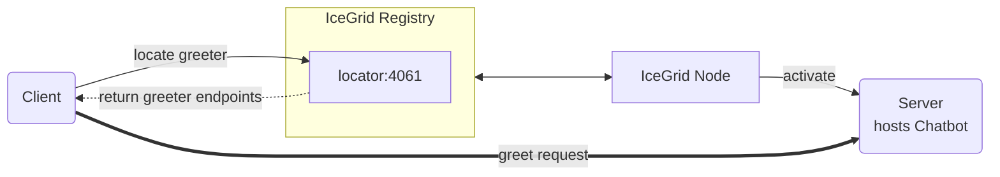

# IceGrid Greeter

The IceGrid Greeter demo illustrates how to call an Ice server managed by IceGrid from a client written in JavaScript.



## Building the demo

First install npm dependencies:

```shell
npm install
```

Then, to build the client application, run:

```shell
npm run build
```

## Running the demo

Ice for JavaScript has limited server-side support, and as a result, we can only implement the client in JavaScript.

You first need to deploy an IceGrid Greeter server from a demo written in a language with full server-side
support, such as C++, C#, Java, Python, or Swift.

In a separate terminal, start the client application:

```shell
node client.js
```
