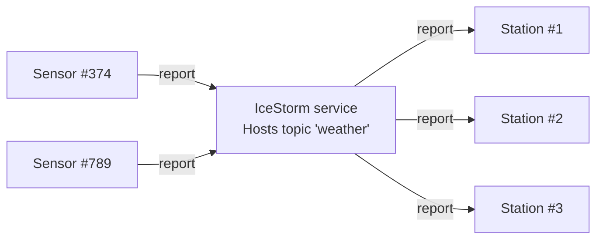

# IceStorm Weather

This demo shows how to use IceStorm to create a simple pub-sub application. In this demo, one or more weather sensors
report the local temperature and humidity to one or more weather stations via IceStorm. The sensors are the publishers
while the weather stations are the subscribers.



Follow these steps to build and run the demo:

1. Install the dependencies:

    ```shell
    npm install
    ```

2. Build the sensor application:

    ```shell
    npm run build
    ```

3. Run the server applications:

    Ice for JavaScript has limited, and as a result, we can only implement the sensors in JavaScript. You need to start
    IceStorm and the weather station(s) from a demo written in a language with full server-side support, such as C++,
    Python, Java or C#.

4. Run the sensor application:

    ```shell
    node sensor.js
    ```
