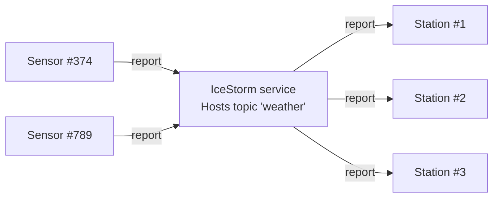

# IceStorm Weather

This demo shows how to use IceStorm to create a simple pub-sub application. In this demo, one or more weather sensors
report the local temperature and humidity to one or more weather stations via IceStorm. The sensors are the publishers
while the weather stations are the subscribers.



## Ice prerequisites

Install IceStorm. See [Ice service installation].

## Building the demo

First install npm dependencies:

```shell
npm install
```

Then, to build the sensor application, run:

```shell
npm run build
```

## Running the demo

Ice for JavaScript has limited server-side support, and as a result, we can only implement the sensors in JavaScript.

You first need to start IceStorm and the weather station(s) from a demo written in a language with full server-side
support, such as C++, Python, Java or C#.

In a separate terminal, start the sensor application:

```shell
node sensor.js
```

[Ice service installation]: https://github.com/zeroc-ice/ice/blob/main/NIGHTLY.md#ice-services
