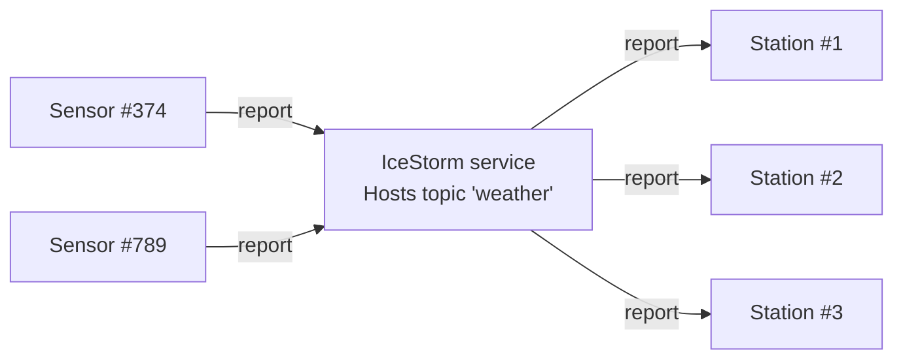

# IceStorm Weather

This demo shows how to use IceStorm to create a simple pub-sub application. In this demo, one or more weather sensors
report the local temperature and humidity to one or more weather stations via IceStorm. The sensors are the publishers
while the weather stations are the subscribers.



Ice for JavaScript has limited [server-side support][1], and as a result, we can only implement the sensors in
JavaScript.

You first need to start IceStorm and the weather station(s) from a demo written in a language with full server-side
support, such as C++, Python, Java or C#.

## Installation

Before building the sensor, install the dependencies:

```shell
npm install
```

## Building the Sensor

Once the dependencies are installed, build the client application with:

```shell
npm run build
```

## Running the Sensor

After building, run the sensor application with:

```shell
node sensor.js
```

[1]: https://doc.zeroc.com/ice/3.7/language-mappings/javascript-mapping
