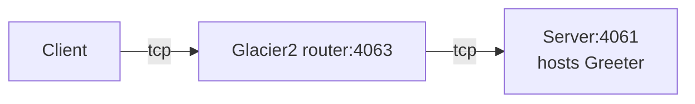

# Glacier2 Greeter

This demo shows how to write a client that calls an Ice object hosted in a server "behind" a Glacier 2 router:



Ice for MATLAB supports only client-side applications. As a result, you first need to start the Glacier2 router and a
Greeter server implemented in a language with server-side support, such as Python, Java, or C#.

Then, in the MATLAB console:

- Go to the Glacier2/greeter directory

```shell
cd matlab/Glacier2/greeter
```

- Compile the Greeter.ice file with the Slice compiler for MATLAB

```shell
slice2matlab Greeter.ice
```

- Run the client application

```shell
client
```
