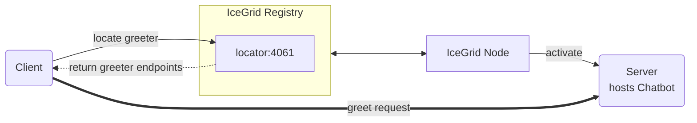

# IceGrid Greeter

The IceGrid Greeter demo illustrates how to call an Ice server managed by IceGrid from a client written in MATLAB.



## Ice prerequisites

- Install the MATLAB dev kit. See [Ice for MATLAB installation].

## Building and running the demo

Ice for MATLAB supports only client-side applications. As a result, you first need to deploy the IceGrid Greeter
server implemented in a language with server-side support, such as Python, Java, or C#.

Then, in the MATLAB console:

- Go to the IceGrid/greeter directory

```shell
cd matlab/IceGrid/greeter
```

- Compile the Greeter.ice file with the Slice compiler for MATLAB

```shell
slice2matlab Greeter.ice
```

- Run the client application

```shell
client
```

[Ice for MATLAB installation]: https://github.com/zeroc-ice/ice/blob/main/NIGHTLY.md#ice-for-matlab
