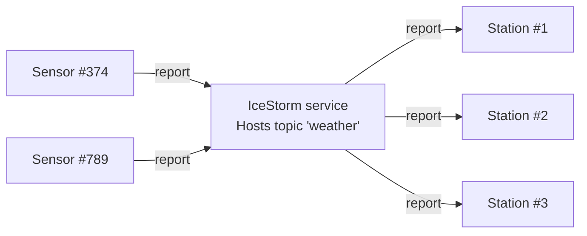

# IceStorm Weather

This demo shows how to use IceStorm to create a simple pub-sub application. In this demo, one or more weather sensors
report the local temperature and humidity to one or more weather stations via IceStorm. The sensors are the publishers
while the weather stations are the subscribers.



## Ice prerequisites

- Install the MATLAB dev kit. See [Ice for MATLAB installation].
- Install the IceStorm service. See [Ice service installation].

## Building and running the demo

Ice for MATLAB supports only client-side applications, and as a result, we can only implement the sensors in MATLAB.

You first need to start IceStorm and the weather station(s) from a demo written in a language with full server-side
support, such as C++, Python, Java or C#.

Then, in the MATLAB console:

- Go to the IceStorm/weather directory

```shell
cd matlab/IceStorm/weather
```

- Compile the WeatherStation.ice file with the Slice compiler for MATLAB

```shell
slice2matlab WeatherStation.ice
```

- Run the sensor

```shell
sensor
```

[Ice for MATLAB installation]: https://github.com/zeroc-ice/ice/blob/main/NIGHTLY.md#ice-for-matlab
[Ice service installation]: https://github.com/zeroc-ice/ice/blob/main/NIGHTLY.md#ice-services
