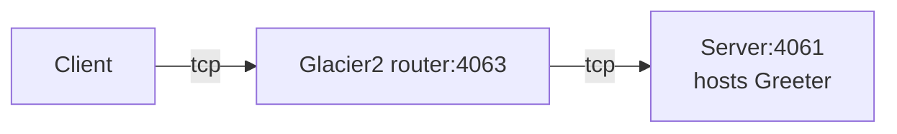

# Glacier2 Greeter

This demo shows how to write a client that calls an Ice object hosted in a server "behind" a Glacier 2 router:



## Ice prerequisites

- Install the PHP dev kit. See [Ice for PHP installation].

## Building and running the demo

Ice for PHP supports only client-side applications. As a result, you first need to start the Glacier2 router and a
Greeter server implemented in a language with server-side support, such as Python, Java, or C#.

Then, in a separate window:

- Go to the Glacier2/greeter directory

```shell
cd php/Glacier2/greeter
```

- Compile the Greeter.ice file with the Slice compiler for PHP

```shell
slice2php Greeter.ice
```

- Run the client application

```shell
php Client.php
```

[Ice for PHP installation]: https://zeroc.com/ice/downloads/3.8/php
