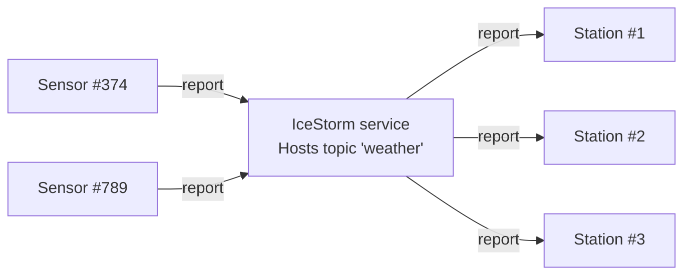

# IceStorm Weather

This demo shows how to use IceStorm to create a simple pub-sub application. In this demo, one or more weather sensors
report the local temperature and humidity to one or more weather stations via IceStorm. The sensors are the publishers
while the weather stations are the subscribers.



## Ice prerequisites

- Install the PHP dev kit. See [Ice for PHP installation].

## Building and running the demo

Ice for PHP supports only client-side applications, and as a result, we can only implement the sensors in PHP.

You first need to start IceStorm and the weather station(s) from a demo written in a language with full server-side
support, such as C++, Python, Java or C#.

Then, in a separate window:

- Go to the IceStorm/weather directory

```shell
cd php/IceStorm/weather
```

- Compile the WeatherStation.ice file with the Slice compiler for PHP

```shell
slice2php WeatherStation.ice
```

- Run the sensor

```shell
php Sensor.php
```

[Ice for PHP installation]: https://github.com/zeroc-ice/ice/blob/main/NIGHTLY.md#ice-for-php
