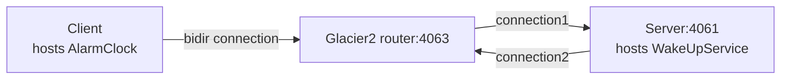

# Glacier2 Callback

This demo shows how to write a client that establishes a session with a Glacier2 router.  
It also shows how to implement callbacks in this client.

This demo is similar to the [Ice Callback][1] demo, except all communications go through the Glacier2 router.

The connection between the client and the Glacier2 router is a "bidir" connection, like in the [Ice Bidir][2] demo:



We recommend running each program in a separate Python virtual environment.  
If you are new to Python virtual environments, see [Python Virtual Environments].

## Running the server

Navigate to the `server` directory.

### 1. Create and activate a Python virtual environment

#### macOS and Linux

```bash
python3 -m venv venv
source venv/bin/activate
```

#### Windows (PowerShell)

```powershell
python -m venv venv
venv\Scripts\activate
```

### 2. Install program dependencies

```bash
pip install -r requirements.txt
```

### 3. Compile the Slice definitions

Use the Slice-to-Python compiler to generate Python code from the `AlarmClock.ice` file:

```bash
slice2py ../slice/AlarmClock.ice
```

### 4. Run the server

```bash
python main.py
```

### 5. Start the Glacier2 router

In a separate terminal, run:

```bash
glacier2router --Ice.Config=config.glacier2
```

> [!TIP]  
> You can start the Glacier2 router before or after the server.  
> The server is identical to the one in the [Ice Callback][1] demo and does not depend on Glacier2.

## Running the client

In a separate terminal, navigate to the `client` directory.

### 1. Create and activate a Python virtual environment

#### macOS and Linux

```bash
python3 -m venv venv
source venv/bin/activate
```

#### Windows (PowerShell)

```powershell
python -m venv venv
venv\Scripts\activate
```

### 2. Install program dependencies

```bash
pip install -r requirements.txt
```

### 3. Compile the Slice definitions

Use the Slice-to-Python compiler to generate Python code from the `AlarmClock.ice` file:

```bash
slice2py ../slice/AlarmClock.ice
```

### 4. Run the client

```bash
python main.py
```

[Python Virtual Environments]: https://docs.python.org/3/tutorial/venv.html  

[1]: ../../Ice/callback  
[2]: ../../Ice/bidir
