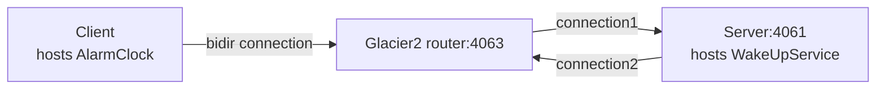

# Glacier2 Callback

This demo shows how to write a client that establishes a session with a Glacier2 router. It also shows how to implement
callbacks in this client.

This demo is similar to the [Ice Callback][1] demo, except all communications go through the Glacier router.

The connection between the client and the Glacier2 router is a "bidir" connection, like in the [Ice Bidir][2] demo:



We recommend running each program in a separate Python virtual environment. If you are new to Python virtual
environments, see [Python Virtual Environments].

## Running the server

Navigate to the `server` directory, to run the server program.

- Create and activate a Python virtual environment:

    ```shell
    python -m venv venv
    source venv/bin/activate  # On macOS/Linux
    venv\Scripts\activate     # On Windows
    ```

- Install the program dependencies:

    ```shell
    pip install -r requirements.txt
    ```

- Compile the AlarmClock.ice file with the Slice compiler for Python:

    ```shell
    slice2py ../slice/AlarmClock.ice
    ```

- Run the server program:

    ```shell
    python main.py
    ```

## Running the client

In a separate terminal, navigate to the `client` directory to run the client program.

- Create and activate a Python virtual environment:

    ```shell
    python -m venv venv
    source venv/bin/activate  # On macOS/Linux
    venv\Scripts\activate     # On Windows
    ```

- Install the program dependencies:

    ```shell
    pip install -r requirements.txt
    ```

- Compile the AlarmClock.ice file with the Slice compiler for Python:

    ```shell
    slice2py ../slice/AlarmClock.ice
    ```

- Run the client program:

    ```shell
    python main.py
    ```

[Python Virtual Environments]: https://docs.python.org/3/tutorial/venv.html

[1]: ../../Ice/Callback
[2]: ../../Ice/Bidir
