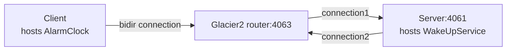

# Glacier2 Callback

This demo shows how to write a client that establishes a session with a Glacier2 router.
It also shows how to implement callbacks in this client.

This demo is similar to the [Ice Callback][1] demo, except all communications go through the Glacier2 router.

The connection between the client and the Glacier2 router is a "bidir" connection, like in the [Ice Bidir][2] demo:



We recommend using [uv] for building and running the demos.

## Ice prerequisites

- Install Glacier2. See [Ice service installation].

## Running the server

Navigate to the `server` directory.

### 1. Compile the Slice definitions

Use the Slice-to-Python compiler to generate Python code from the `AlarmClock.ice` file:

```bash
uv run slice2py ../slice/AlarmClock.ice
```

### 2. Run the server

```bash
uv run main.py
```

### 3. Start the Glacier2 router

In a separate terminal, run:

```bash
glacier2router --Ice.Config=config.glacier2
```

> [!TIP]
> You can start the Glacier2 router before or after the server.
> The server is identical to the one in the [Ice Callback][1] demo and does not depend on Glacier2.

## Running the client

In a separate terminal, navigate to the `client` directory.

### 1. Compile the Slice definitions

Use the Slice-to-Python compiler to generate Python code from the `AlarmClock.ice` file:

```bash
uv run slice2py ../slice/AlarmClock.ice
```

### 2. Run the client

```bash
uv run main.py
```

[uv]: https://docs.astral.sh/uv/
[Ice service installation]: https://github.com/zeroc-ice/ice/blob/main/NIGHTLY.md#ice-services

[1]: ../../Ice/callback
[2]: ../../Ice/bidir
