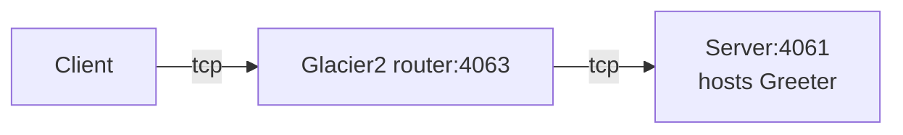

# Glacier2 Greeter

This demo shows how to write a client that calls an Ice object hosted in a server "behind" a Glacier2 router:



In a typical Glacier2 deployment, the client can establish a connection to the Glacier2 router but cannot connect
directly to the server, because the server is on a separate network.

We recommend using [uv] for building and running the demos.

## Ice prerequisites

- Install Glacier2. See [Ice service installation].

## Running the server

Navigate to the `server` directory.

### 1. Compile the Slice definitions

Use the Slice-to-Python compiler to generate Python code from the `Greeter.ice` file:

```bash
uv run slice2py ../slice/Greeter.ice
```

### 2. Run the server

```bash
uv run main.py
```

### 3. Start the Glacier2 router

In a separate terminal, run:

```bash
glacier2router --Ice.Config=config.glacier2
```

> [!TIP]
> You can start the Glacier2 router before or after the server.
> The server is identical to the one in the [Ice Greeter] demo and does not depend on Glacier2.

## Running the client

In a separate terminal, navigate to the `client` directory.

### 1. Compile the Slice definitions

Use the Slice-to-Python compiler to generate Python code from the `Greeter.ice` file:

```bash
uv run slice2py ../slice/Greeter.ice
```

### 4. Run the client

```bash
uv run main.py
```

[uv]: https://docs.astral.sh/uv/
[Ice Greeter]: ../../Ice/greeter
[Ice service installation]: https://github.com/zeroc-ice/ice/blob/main/NIGHTLY.md#ice-services
