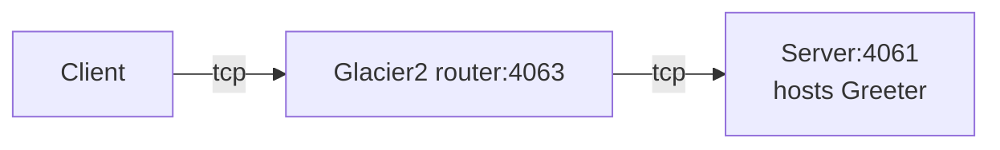

# Glacier2 Greeter

This demo shows how to write a client that calls an Ice object hosted in a server "behind" a Glacier 2 router:



In a typical Glacier2 deployment, the client can establish a connection to the Glacier2 router but cannot establish
a connection to the server, because the server is on a separate network.

We recommend running each program in a separate Python virtual environment. If you are new to Python virtual
environments, see [Python Virtual Environments].

## Running the server

Navigate to the `server` directory to run the server program.

- Create and activate a Python virtual environment:

    **On macOS and Linux**

    ```shell
    python3 -m venv venv
    source venv/bin/activate
    ```

    **On Windows**

    ```powershell
    python -m venv venv
    venv\Scripts\activate
    ```

- Install the program dependencies:

    ```shell
    pip install -r requirements.txt
    ```

- Compile the Greeter.ice file with the Slice compiler for Python:

    ```shell
    slice2py ../slice/Greeter.ice
    ```

- Run the server program:

    ```shell
    python main.py
    ```

- Start the Glacier2 router in its own terminal:

   ```shell
   glacier2router --Ice.Config=config.glacier2
   ```

   > [!TIP]
   > You can also start the Glacier2 router before the server. The order does not matter: the server is identical to the
   > server provided in the [Ice Greeter] demo and does not depend on Glacier2.

## Running the client

In a separate terminal, navigate to the `client` directory to run the client program.

- Create and activate a Python virtual environment:

    **On macOS and Linux**

    ```shell
    python3 -m venv venv
    source venv/bin/activate
    ```

    **On Windows**

    ```powershell
    python -m venv venv
    venv\Scripts\activate
    ```

- Install the program dependencies:

    ```shell
    pip install -r requirements.txt
    ```

- Compile the Greeter.ice file with the Slice compiler for Python:

    ```shell
    slice2py ../slice/Greeter.ice
    ```

- Run the client program:

    ```shell
    python main.py
    ```

[Python Virtual Environments]: https://docs.python.org/3/tutorial/venv.html
[Ice Greeter]: ../../Ice/greeter
