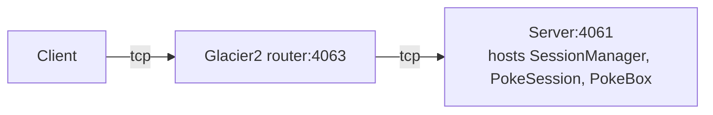

# Glacier2 Session

This demo shows how to implement and configure a Session Manager with Glacier2. A Session Manager creates
application-level session objects that typically maintain some per-session state.

This demo also illustrates how to use a default servant that implements multiple objects (see the SharedPokeBox class).

In the demo, the client catches Pokémon and stores them in a PokeBox hosted by the server behind the Glacier2 router:



In a typical Glacier2 deployment, the client can establish a connection to the Glacier2 router but cannot establish
a connection to the server, because the server is on a separate network.

## Prerequisites

- Install uv. See [Installing uv].
- Install Glacier2. See [Glacier2 installation].

## Running the server

Navigate to the `server` directory.

### 1. Compile the Slice definitions

Use the Slice-to-Python compiler to generate Python code from the `PokeBox.ice` file:

```shell
uv run slice2py ../slice/PokeBox.ice
```

### 2. Run the server

```shell
uv run main.py
```

### 3. Start the Glacier2 router

In a separate terminal, run:

```shell
glacier2router --Ice.Config=glacier2.conf
```

> [!TIP]
> You can start the Glacier2 router before or after the server.

## Running the client

In a separate terminal, navigate to the `client` directory.

### 1. Compile the Slice definitions

Use the Slice-to-Python compiler to generate Python code from the `PokeBox.ice` file:

```shell
uv run slice2py ../slice/PokeBox.ice
```

### 2. Run the client

```shell
uv run main.py ash
uv run main.py ash
uv run main.py ash
```

If you don't specify a name, the client uses the current username.

[Installing uv]: https://docs.astral.sh/uv/getting-started/installation/
[Glacier2 installation]: https://zeroc.com/ice/downloads/3.8/glacier2
