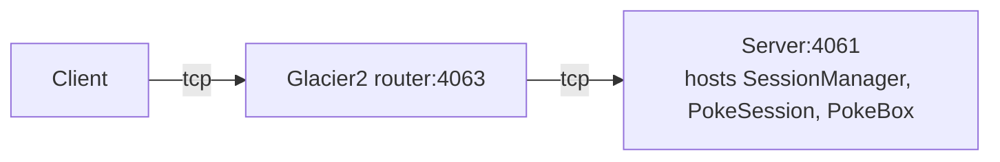

# Glacier2 Session

This demo shows how to implement and configure a Session Manager with Glacier2. A Session Manager creates
application-level session objects that typically maintain some per-session state.

This demo also illustrates how to use a default servant that implements multiple objects (see the SharedPokeBox class).

In the demo, the client catches Pokémon and stores them in a PokeBox hosted by the server behind the Glacier2 router:



In a typical Glacier2 deployment, the client can establish a connection to the Glacier2 router but cannot establish
a connection to the server, because the server is on a separate network.

We recommend running each program in a separate Python virtual environment.
If you are new to Python virtual environments, see [Python Virtual Environments].

## Ice prerequisites

- Install Glacier2. See [Ice service installation].

## Running the server

Navigate to the `server` directory.

### 1. Create and activate a Python virtual environment

#### macOS and Linux

```bash
python3 -m venv venv
source venv/bin/activate
```

#### Windows (PowerShell)

```powershell
python -m venv venv
venv\Scripts\activate
```

### 2. Install program dependencies

```bash
pip install -r requirements.txt
```

### 3. Compile the Slice definitions

Use the Slice-to-Python compiler to generate Python code from the `PokeBox.ice` file:

```bash
slice2py ../slice/PokeBox.ice
```

### 4. Run the server

```bash
python main.py
```

### 5. Start the Glacier2 router

In a separate terminal, run:

```bash
glacier2router --Ice.Config=config.glacier2
```

> [!TIP]
> You can start the Glacier2 router before or after the server.

## Running the client

In a separate terminal, navigate to the `client` directory.

### 1. Create and activate a Python virtual environment

#### macOS and Linux

```bash
python3 -m venv venv
source venv/bin/activate
```

#### Windows (PowerShell)

```powershell
python -m venv venv
venv\Scripts\activate
```

### 2. Install program dependencies

```bash
pip install -r requirements.txt
```

### 3. Compile the Slice definitions

Use the Slice-to-Python compiler to generate Python code from the `PokeBox.ice` file:

```bash
slice2py ../slice/PokeBox.ice
```

### 4. Run the client

```bash
python main.py ash
python main.py ash
python main.py ash
python main.py ash
```

If you don't specify a name, the client uses the current username.

[Python Virtual Environments]: https://docs.python.org/3/tutorial/venv.html
[Ice service installation]: https://github.com/zeroc-ice/ice/blob/main/NIGHTLY.md#ice-services
