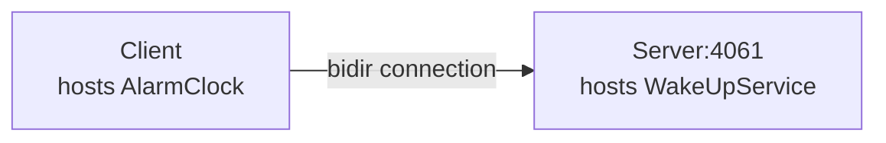

# Bidir

The Bidir demo illustrates how to send requests "the other way around", from a server to a client, by reusing the
connection established by the client to the server.

This demo is very similar to the [Callback][1] demo: with the Callback demo, the server opens a connection to the

client, while with this demo, there is only one connection, from the client to the server:



This is particularly useful when the client application is behind a firewall that does not allow incoming connections.

We recommend using [uv] for building and running the demos.

## Running the server

Navigate to the `server` directory.

### 1. Compile the Slice definitions

Use the Slice-to-Python compiler to generate Python code from the `AlarmClock.ice` file:

```shell
uv run slice2py ../slice/AlarmClock.ice
```

### 2. Run the server

```shell
uv run main.py
```

## Running the client

In a separate terminal, navigate to the `client` directory.

### 1. Compile the Slice definitions

Use the Slice-to-Python compiler to generate Python code from the `AlarmClock.ice` file:

```bash
uv run slice2py ../slice/AlarmClock.ice
```

### 2. Run the client

```bash
uv run main.py
```

[uv]: https://docs.astral.sh/uv/
[1]: ../callback/
