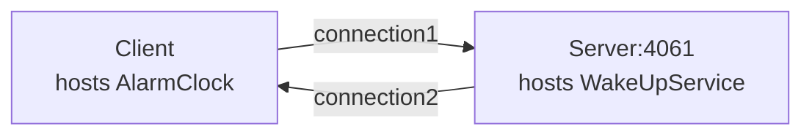

# Ice Callback

The Callback demo illustrates how to implement callbacks in a client application.

In this demo, the client hosts an alarm clock (an Ice object), and asks the server's wake up service to call this
object at a later time. The server opens a TCP connection to the client when making this call.



We recommend running each program in a separate Python virtual environment. If you are new to Python virtual
environments, see [Python Virtual Environments].

## Running the server

Navigate to the `server` directory, to run the server program.

- Create and activate a Python virtual environment:

```shell
python -m venv venv
source venv/bin/activate  # On macOS/Linux
venv\Scripts\activate     # On Windows
```

- Install the program dependencies:

```shell
pip install -r requirements.txt
```

- Compile the AlarmClock.ice file with the Slice compiler for Python:

```shell
slice2py ../slice/AlarmClock.ice
```

- Run the server program:

```shell
python main.py
```

## Running the client

In a separate terminal, navigate to the `client` directory to run the client program.

- Create and activate a Python virtual environment:

```shell
python -m venv venv
source venv/bin/activate  # On macOS/Linux
venv\Scripts\activate     # On Windows
```

- Install the program dependencies:

```shell
pip install -r requirements.txt
```

- Compile the AlarmClock.ice file with the Slice compiler for Python:

```shell
slice2py ../slice/AlarmClock.ice
```

- Run the client program:

```shell
python main.py
```

[Python Virtual Environments]: https://docs.python.org/3/tutorial/venv.html
