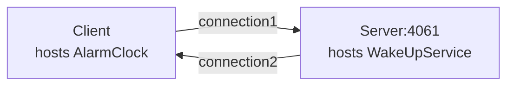

# Ice Callback

The Callback demo illustrates how to implement callbacks in a client application.

In this demo, the client hosts an alarm clock (an Ice object) and asks the server's wake-up service to call this
object at a later time. The server opens a TCP connection to the client when making this call.



## Prerequisites

- Install uv. See [Installing uv].

## Running the server

Navigate to the `server` directory.

### 1. Compile the Slice definitions

Use the Slice-to-Python compiler to generate Python code from the `AlarmClock.ice` file:

```shell
uv run slice2py ../slice/AlarmClock.ice
```

### 2. Run the server

```shell
uv run main.py
```

## Running the client

In a separate terminal, navigate to the `client` directory.

### 1. Compile the Slice definitions

Use the Slice-to-Python compiler to generate Python code from the `AlarmClock.ice` file:

```shell
uv run slice2py ../slice/AlarmClock.ice
```

### 2. Run the client

```shell
uv run main.py
```

[Installing uv]: https://docs.astral.sh/uv/getting-started/installation/
